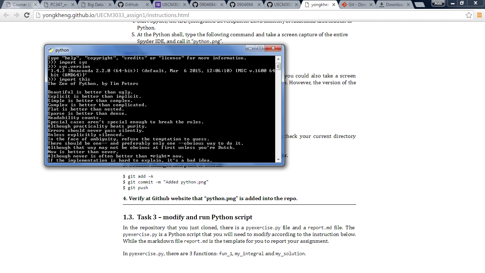

UECM3033 Assignment #1 Report
========================================================

- Prepared by: ** Put your name here**
- Tutorial Group: T2/T3
- Date: 12/12/2015

--------------------------------------------------------

## Task 1 -- setup a github repository

The reports, codes and supporting documents are uploaded to Github at: 

[https://github.com/your_github_id/UECM3033_assign1](https://github.com/your_github_id/UECM3033_assign1)


---------------------------------------------------------

## Task 2 -- setup python





This part of the assignment consists of two parts:

1. Install and take a screen capture of your Python.
2. Save your screen shot onto GitHub repository.

For the installation of Python, you are encouraged to download and install Anaconda, a completely free Python distribution from Continuum Analytic. 

1. Go to [http://continuum.io/downloads](http://continuum.io/downloads)
2. Choose "Python 3.5" suitable to your operating system.
3. Download and install.
4. Start Spyder, the IDE (Integrated Development Environment) of Anaconda distribution of Python.
5. At the Python shell, type the following command and take a screen capture of the entire Spyder IDE, and call it "python.png"

```{}
import sys
sys.version
import this
```

If you prefer other distribution of Python other than Anacoda, you could also take a screen capture of the Python of your choice with the 3 lines of code above. However, the version of the Python used, must be 3.1 and above.

Next is to merge your file "python.png" with your GitHub repository.

#### 1. Clone the repository
```
$ git clone https://github.com/your_github_id/UECM3033_assign1
```
This will create a *UECM3033_assign1* folder. (Remember you can check your current directory with *pwd* and *ls*.) Change into the *UECM3033_assign1* folder.

#### 2. Copy "python.png" into *UECM3033_assign1* folder.

#### 3. Commit changes and push to GitHub.
```
$ git add -A
$ git commit -m "Added python.png"
$ git push
```

#### 4. Verify at GitHub website that "python.png" is added into the repo.

------------------------------------------------------------

## Task 3 -- modify and run a given Python script

In the repository that you just cloned, there is a "plot_rnd.py" file. Open the file, edit the following two lines by keyin your student id as the seed of the random number generator. 
```
np.random.seed(1234)
...
plt.savefig('foo.png')
```
2. Run the python script.
3. Save the resulting picture as "plot_rnd.png".
4. Upload into GitHub together with your modified python script

Thee resulting figure is something similar to the following:


